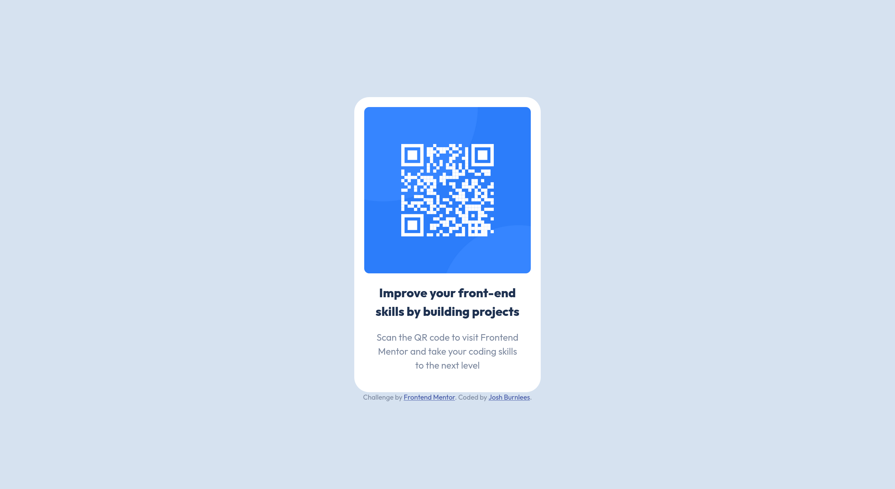

# Frontend Mentor - QR code component solution

This is a solution to the [QR code component challenge on Frontend Mentor](https://www.frontendmentor.io/challenges/qr-code-component-iux_sIO_H). Frontend Mentor challenges help you improve your coding skills by building realistic projects.

  

## Table of contents

  

- [Overview](#overview)

- [Screenshot](#screenshot)

- [Links](#links)

- [My process](#my-process)

- [Built with](#built-with)

- [What I learned](#what-i-learned)

- [Continued development](#continued-development)

- [Useful resources](#useful-resources)

- [Author](#author)

  
  

## Overview

  

### Screenshot

  



  

### Links

  

- Live Site URL: [https://burnlees.github.io/qr-code-component/](https://burnlees.github.io/qr-code-component/)

  

## My process

  

### Built with

  

- Semantic HTML5 markup

- CSS custom properties

- Flexbox

- CSS Grid

  

### What I learned

  

This was a good opportunity to put into practise all I've learned recently in terms of HTML and CSS, particularly Grid and Flex. Furthermore, having never used or looked into CSS custom properties before, this was a great learning opportunity for me, I went to Kevin Powell on youtube for further understanding on the subject.

  

Example of setting custom properties and useful naming conventions for them :

  

```

:root {

--clr-white: hsl(0, 0%, 100%);

--clr-light-gray: hsl(212, 45%, 89%);

--clr-grayish-blue: hsl(220, 15%, 55%);

--clr-dark-blue: hsl(218, 44%, 22%);

  

--ff-base: "Outfit", sans-serif;

  

--fw-regular: 400;

--fw-bold: 800;

}

```

  
  

### Continued development

  

I'd like to gain further understanding of Grid and Flexbox, perhaps there were more elgant ways to achieve the layout I emplemented in this project.

  

I feel like I also struggled somewhat with getting correct sizing to match the design, particularly with the text.

  

### Useful resources

  

- [Kevin Powell - Learn Grid The Easy Way](https://youtu.be/rg7Fvvl3taU?si=KgADvbguu0Xr8Rsg) - Great video that helped me undertsand CSS Grid.

- [Example resource 2](https://cssgridgarden.com/) - Great game that helped me learn CSS Grid concepts and properties.

- [Kevin Powell - Taking on a Frontend Mentor challenge](https://youtu.be/B2WL6KkqhLQ?si=_0TcnHNugKJqymAa) - I found this video useful for many reasons, helped me understand how to properly set CSS Custom Properties and how to use them. With setting up a good CSS reset and HTML semantics.

  

## Author

  

- Frontend Mentor - [@burnlees](https://www.frontendmentor.io/profile/burnlees)

